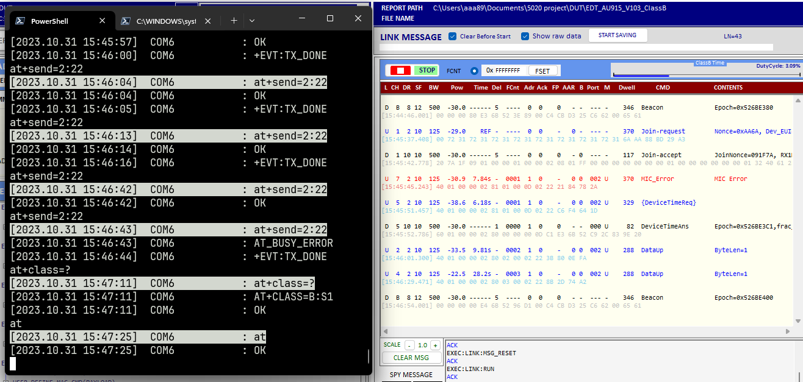
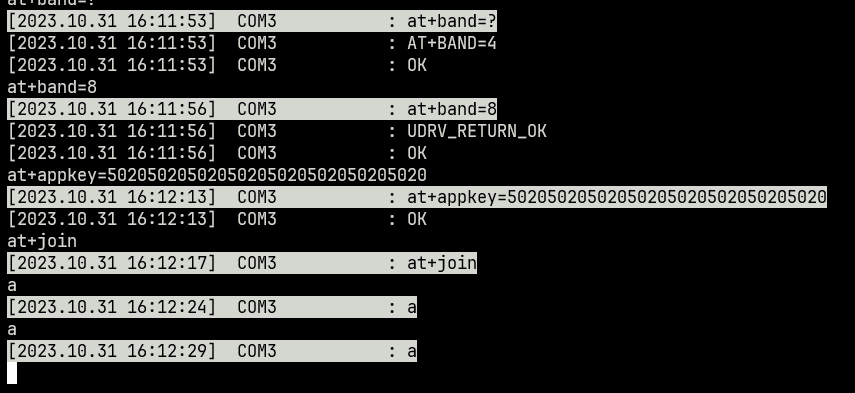
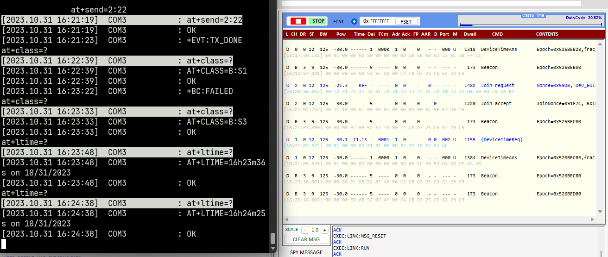
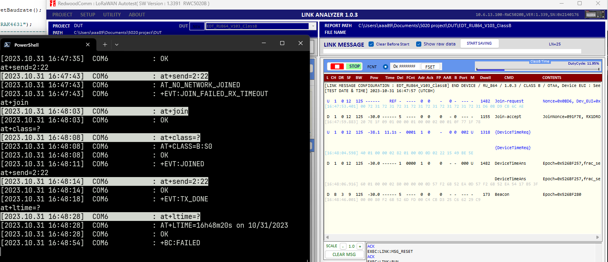
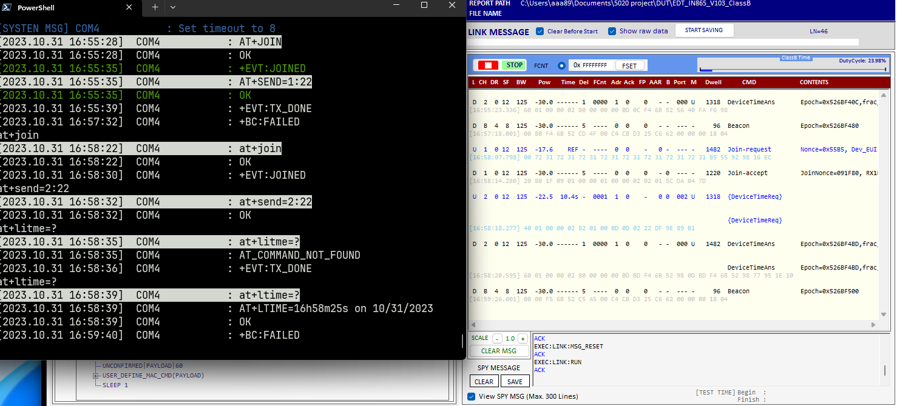

# SHEET
| Region | Model      | Result           |
| ----   | ----       | ----             |
| US915  | 3172-E     | PASS             |
| CN470  | 3172-T     | PASS             |
| EU868  | 11720      | PASS             |
| KR920  | 11720      | PASS             |
| AU915  | 4631       | Beacon_fail      |
| AS923  | 3272-SiP   | FAIL             |
| EU433  | 3272LP-SiP | Beacon_fail      |
| CN779  | 3172L-E    | 5020 not support |
| RU864  | 4631       | Beacon_fail      |
| IN865  | 3172-T     | Beacon_fail      |

# FAIL
- 4631_AU915 DUT did not received beacon.

- 3272-SiP_AS923 input `AT+JOIN` then hang.

- 3272LP-SiP_EU433 DUT did not received beacon.

- 4631_RU864 DUT did not received beacon.

- 3172-T_IN865 DUT did not received beacon.

