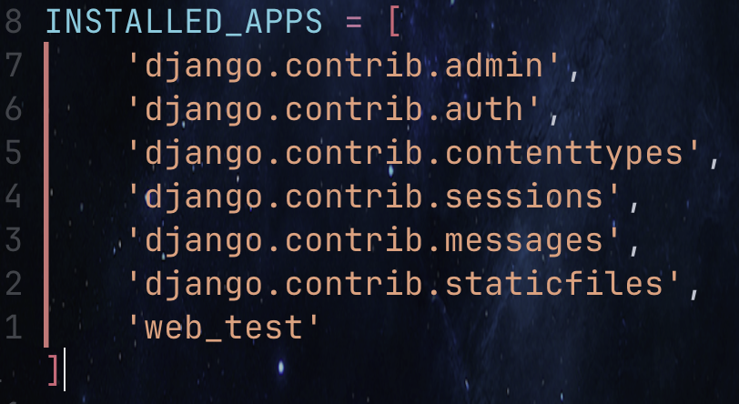

# Django CLI CMD

- Create a new project by running the following command:   
```shell
django-admin startproject XXX . €kd# XXX: project name
```
- Create an empty development database by running the following command:
```shell
manage.py migrate
```
- start Django's development server using the command python manage.py runserver:
```shell
python manage.py runserver
```
## create app
- Create a new app by running the following command:
```shell
python manage.py startapp XXX # XXX: app name
```
建立完請記得è¦å°‡ App 加入設定檔
請在 settings.py 裡é¢çš„ INSTALLED_APPS 加入 App (也就是你自己建立的 App å稱)
€kd


## åƒè€ƒç¶²ç«™
[教學網å€]( <https://gitaub.caa/twtrubiks/django-tutorial> )
